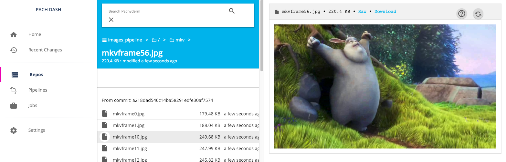
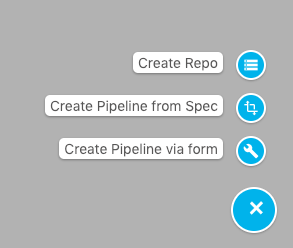
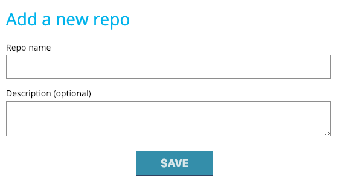
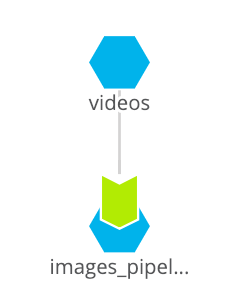
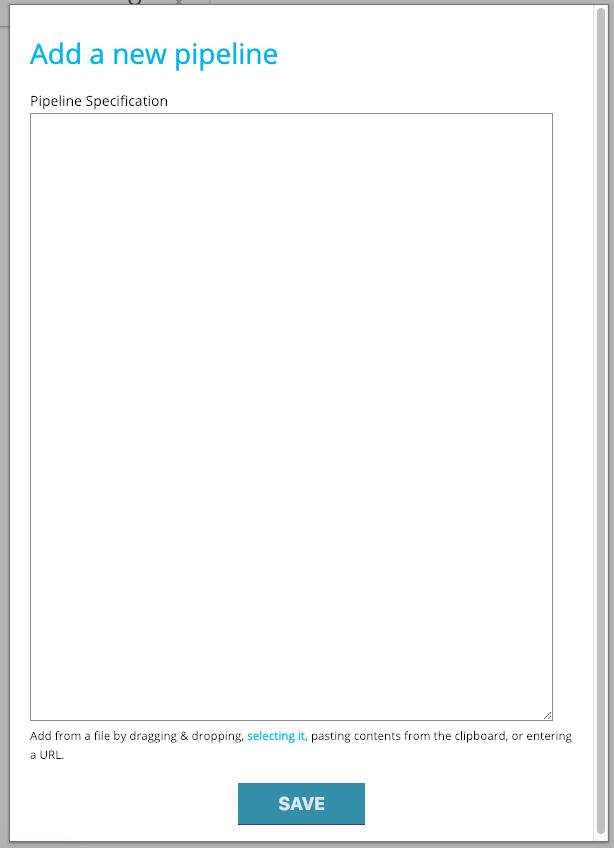
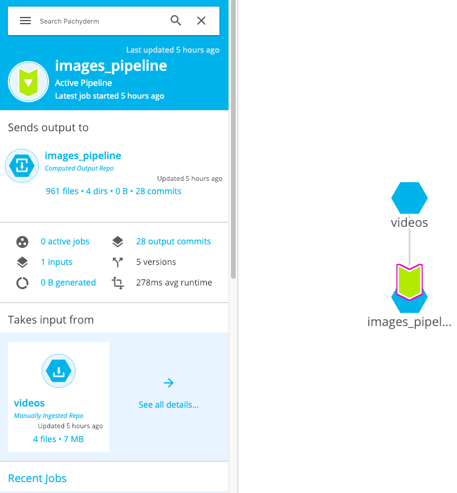
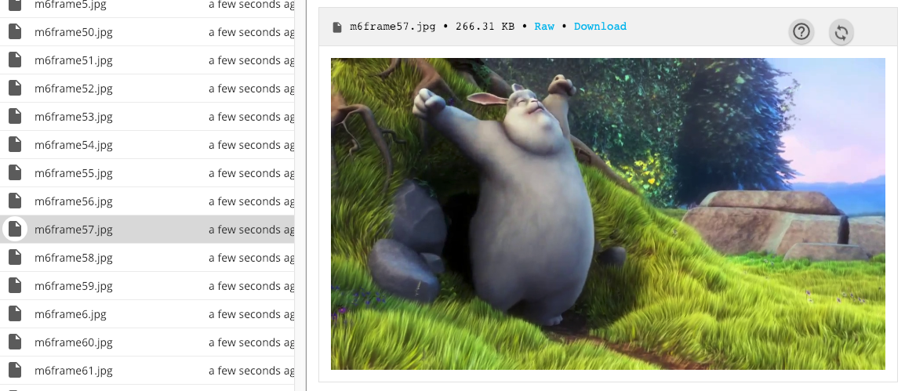

# Example

## Videos to images with Pachyderm


      
In this example you'll use Pachyderm to take one or more video files and split them into individual frames using the opencv library. With this example running, getting individual image frames from videos is a piece of cake. 

As part of this example we'll introduce you to some of the Pachyderm Dashboard's features. The Dashboard is part of the Pachyderm Enterprise Edition. New users receive a token for a two-week free trial of the Pachyderm Enterprise Edition. 

Pachyderm quickly processes multiple videos simultaneously through parallelization. Additionally, when videos are added, the Pachyderm pipeline runs automatically, outputting frames as .jpg files in a folder for each video. After this project you'll have pictures you can put on coffee mugs and calendars for your friends in no time :).

 Let's get started!

## Prerequisites
This example assumes you have Pachyderm running locally. Check out the [Local Installation instructions](https://pachyderm.readthedocs.io/en/stable/getting_started/local_installation.html) if you haven’t istalled pachyderm. 

## Step 1: Create a Pachyderm repo

``` pachctl create-repo videos

# list repo
pachctl list-repo
```

Alternatively, you can create your repo in the Pachyderm dashboard in your browser at *localhost:300080* by 
clicking on the *+* icon in the bottom right of the page. 

Then click on *Create Repo*.



Then type *videos* in the *Repo name* field and click *save*.



## Step 2: Create a Pachyderm pipeline

Pipelines are specified in a JSON file. For this example, we've already created a pipeline for you. The pipeline code is [here](/frames.json). The full pipeline spec is [here](http://docs.pachyderm.io/en/latest/reference/pipeline_spec.html). 

For now, we're going to create a single pipeline that takes one or more videos and outputs up to the first 1,000 frames of each video as .jpg images. 

When a pipeline is created, Pachyderm runs your code on the data in your input repo. In this case your data is your videos. The pipeline runs again to process new videos each time they are added to your input repo. 

The first time Pachyderm runs a pipeline, it downloads the Docker image specified in the pipeline spec from the specified Docker registry (Docker Hub in this case). This first download might take a few minutes, depending on your Internet connection speed. Subsequent runs should be faster.

If you have the Pachyderm dashboard open, you'll see magic happen when you create your pipeline from the command line.



Pachyderm will automatically create your output pipeline and output repository based on your .JSON pipeline spec.

`$ pachctl create-pipeline -f https://raw.githubusercontent.com/discdiver/pachy-vid/master/frames.json`
   

Below is the pipeline spec and Python code we're using. Let's walk through the details.

# frames.json
```
{
  "pipeline": {
    "name": "images_pipeline"
  },
  "input": {
    "atom": {
      "glob": "/*",
      "repo": "videos"
    }
  },
  "transform": {
    "cmd": [ "python", "./frames.py" ],
    "image": "discdiver/frames:v1.32"
  },
  "parallelism_spec":{
    "coefficient": 2
  },
  "enable_stats": true,
}
```

This Pachyderm pipeline spec contains five sections. First is the pipeline name, *frames*. This name becomes the name of your pipeline output repo.

Second is the input. Here we have one "atom" input: our images repo with a '/*' glob pattern. 

The glob pattern defines how the input data can be broken up for parallel processing. `/*` means that each top level file can be processed individually, assuming you have enough workers available. This setting makes sense for this example. Glob patterns are a powerful Pachyderm feature. 

Third is the transform that specifies the Docker image to use, *discdiver/frames:v1.32* (defaults to Docker Hub for the registry), and the entry point script *frames.py*. 

Fourth is the *parallelism_spec* that determines how many workers the pipeline uses.

The final part of the pipeline spec is "enable_stats:true", which allows you to see useful information about the pipeline when a job runs.

If you are using the Pachyderm Enterprise dashboard, you can expand the bottom right menu and create a Pipeline from a form or by copying your code into a file.



The pipeline specifies that the `frames.py` Python file will be run when a commit is made. So when the pipeline is made for the first time, when data is added to the pipeline, or when a pipeline is updated such that Pachyderm is told the application code changed, frames.py will run. `frames.py` is packaged with the Docker image and created as part of the Docker container. 

The `frames.py` code is below. 

```
# frames.py
import os
import cv2
import numpy as np

top = os.getcwd()

def make_images(video, max_images=1000):
    '''
    Outputs .jpg images from a video file

    Args:
        video (str):     File name of video
        max_images (int): Maximumum number of images to output per video.
    Returns:
        none
    '''

    file_name = os.path.split(video)[1]
    file_no_ext = file_name.split(".")[0]

    vidcap = cv2.VideoCapture(video)
    vid_length = int(vidcap.get(cv2.CAP_PROP_FRAME_COUNT))

    count = 0             # counter to stay under max images
    #print("/pfs/out/{}".format(file_no_ext))
    os.mkdir("/pfs/out/{}".format(file_no_ext))  #cv2 requires directory to exist

    while count < max_images and count < vid_length:
        try:
            success, image = vidcap.read()
            cv2.imwrite(os.path.join("/pfs/out/{}".format(file_no_ext), file_no_ext + "frame{:d}.jpg".format(count)), image)
        except Exception as e:
            print("Oops, there was an exception: {}".format(e))

        count += 1

ok_file_type = {'mp4', '3gp', 'flv', 'mkv'}

# walk /pfs/videos and call make_images on every file found
for dirpath, dirs, files in os.walk("/pfs/videos"):
    for file in files:
        if file[-3:] in ok_file_type:
            make_images(os.path.join(dirpath, file))

```

*/pfs/images_pipeline* and */pfs/out* are local directories that Pachyderm creates for you. All the input data for a pipeline will be found in */pfs/input_repo_name*, where *input_repo_name* is specified in your Pachyderm .json specification file. 

Your code should always write out to */pfs/out* or a subdirectory you create inside */pfs/out*. Pachyderm will automatically gather everything written to */pfs/out* and version it in the pipeline's output commit.

## Step 3: Put data into Pachyderm

From the command line use `put-file` along with the `-f` flag to denote a local file, a URL, or an object storage bucket (e.g. s3). In this case, if you have the current repo cloned you can just upload a video file from this project folder. Or you can upload a video file of type .mp4, .flv, mkv, or 3gp. 

Also specify the repo name "videos", the branch name "master", a name for the video file, e.g. "buck_bunny.mp4", and the path to the file.

``` pachctl put-file videos master buck_bunny.mp4 -f /buck_bunny.mp4 ```

When you add a file to Pachyderm it automatically makes a commit of your data. 

## Step 4: View the commit 
See the commit with
```pachctl list-commit videos```
and see the files committed with  
```pachctl list-file videos master```

In the Pachyderm dashboard you can dive into the details of the commit and interactively visualize and explore your jobs.



## Step 5: View your beautiful images
See an individual image frame by getting it from your Pachyderm repo and viewing with this command on a Mac:
```
$ pachctl get-file images_pipeline master buck_bunny/buck_bunnyframe1.jpg | open -f -a /Applications/Preview.app
```

Alternatively, in the Pachyderm dashboard, you can navigate to the output files from your commit and preview or download your images. 



There's lots to checkout in the Pachyderm dashboard, so have a look around!

## Step 6: Keep building!
You've seen just how easy it is to set up a Pachyderm Pipeline that takes in a video files, manipulates them, and ouptputs new image files. 

To make changes to *frames.py* or *frames.json* and iterate quickly, check out the [Pachyderm Workflow](/pachderm_workflow.md) document.

Or if you want to see what else Pachyderm can do try out another example [Pachyderm Examples](http://docs.pachyderm.io/en/stable/examples/README.html)

When you're ready to upgrade to Enterprise talk to the friendly folks at [sales](mailto:sales@pachyderm.io). 

The Pachyderm team is here to help you every step of the way. Please submit any issues or questions you come across on [GitHub](), [Slack](), or email at support@pachyderm.io!

*Icons from FlatIcon[https://www.flaticon.com/].*
